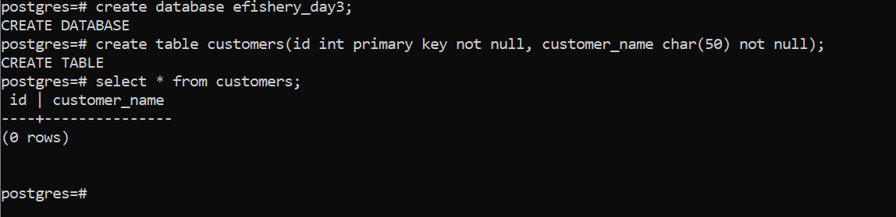
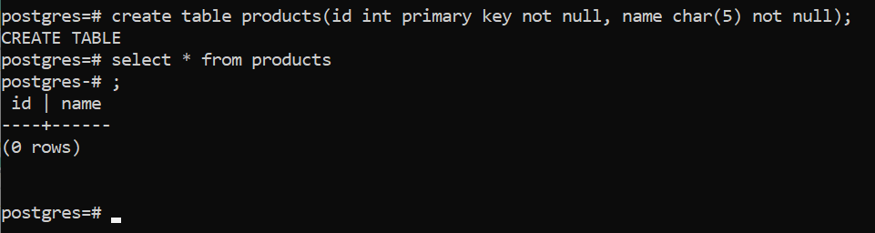
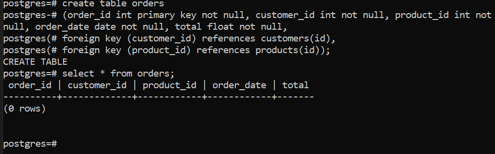
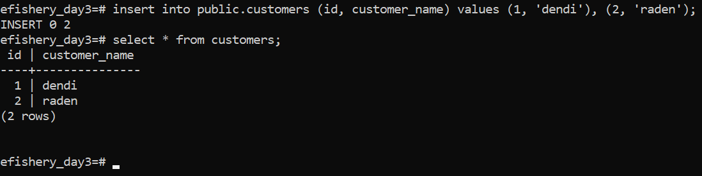
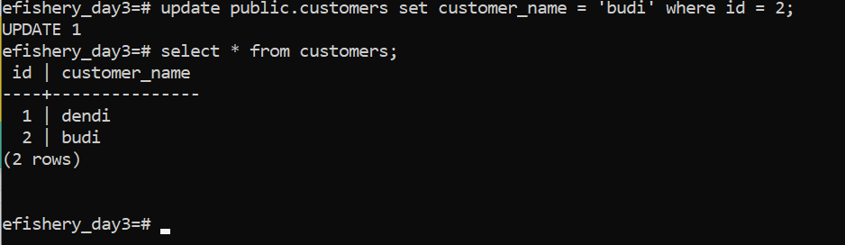
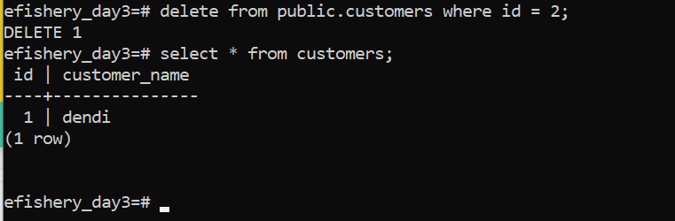
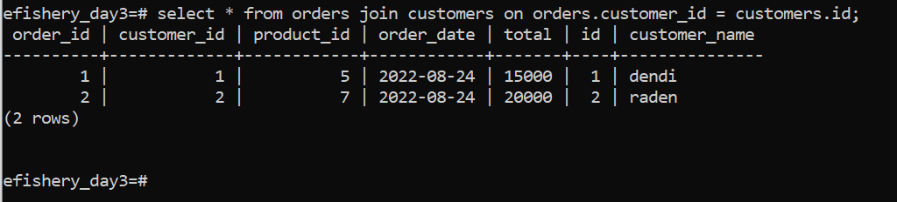

# Praktikum Database

## Soal

Buatlah query untuk membuat tabel seperti di bawah ini.
Setelah itu buat query untuk insert, update, dan delete di masing-masing tabel.
Serta join di tabel order.

### **Membuat tabel**

Query yang digunakan untuk membuat **tabel customers**.

`create table customers(id int primary key not null, customer_name char(50) not null);`

Query yang digunakan untuk membuat **tabel products**;

`create table products(id int primary key not null, name char (50) not null);`

Query yang digunakan untuk membuat **tabel order**;

`create table orders (order_id int primary key not null, customer_id int not null, product_id not null, order_date date not null, total float not null, foreign key (customer_id) references customers(id), foreign key (product_id) references products(id) );`

### **Insert**

`insert into public.customers (id, customer_name) values (1, 'dendi'), (2, 'raden');`

### **Update**

`update public.customers set customer_name = 'budi' where id = 2;`

### **Delete**

`delete from public.customers where id = 2;`

### **Join**

Salah satu contoh join\
`select * from orders join customer on orders.customer_id = customers.id;`

